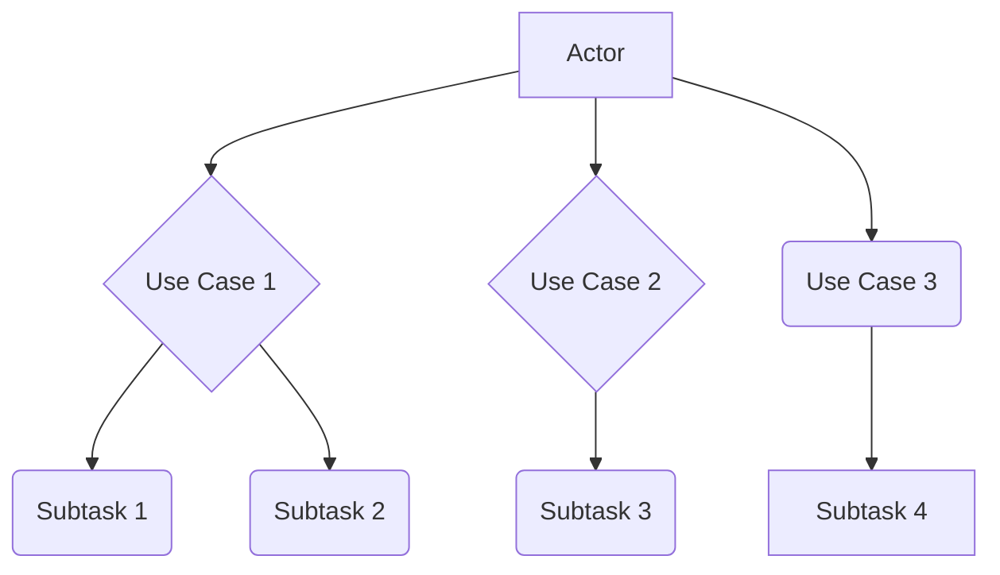

```mermaid

graph TD
  A[Actor] --> UC1{Use Case 1}
  A --> UC2{Use Case 2}
  A --> UC3(Use Case 3)
  UC1 --> S1(Subtask 1)
  UC1 --> S2(Subtask 2)
  UC2 --> S3(Subtask 3)
  UC3 --> S4[Subtask 4]

```
